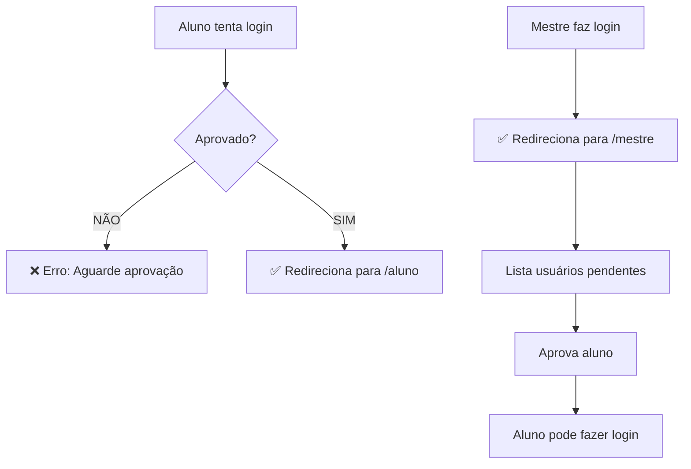

# Alunos de Teste Criados

## 🎯 Alunos Disponíveis para Teste

### 👤 Aluno 1: João Silva Santos

- **Email**: `aluno.teste@gmail.com`
- **Senha**: `aluno123`
- **ID**: `917a0521-3992-4290-a253-0343bb1a3bd4`
- **Status**: ❌ **NÃO APROVADO**
- **Dados Completos**:
  - Nome: João Silva Santos
  - Data Nascimento: 15/03/1995 (29 anos)
  - Altura: 175 cm
  - Peso: 70 kg
  - Escolaridade: Ensino Médio Completo
  - Cor da Faixa: Branca
  - Escola: Academia Bushido
  - Contato: (11) 99999-8888
  - Endereço: Rua das Flores, 123 - São Paulo, SP

### 👤 Aluno 2: Maria Oliveira Costa

- **Email**: `maria.oliveira@gmail.com`
- **Senha**: `maria123`
- **ID**: `ccf05379-867b-46b1-af55-df32c97a701c`
- **Status**: ❌ **NÃO APROVADO**
- **Dados Completos**:
  - Nome: Maria Oliveira Costa
  - Data Nascimento: 22/07/1998 (26 anos)
  - Altura: 165 cm
  - Peso: 58 kg
  - Escolaridade: Ensino Superior Incompleto
  - Cor da Faixa: Amarela
  - Escola: Centro de Artes Marciais Samurai
  - Contato: (11) 88888-7777
  - Endereço: Av. Paulista, 456 - São Paulo, SP

## 🧪 Como Testar o Sistema

### 1. Teste de Login com Aluno NÃO Aprovado

1. Acesse: http://localhost:3002/login
2. Use: `aluno.teste@gmail.com` / `aluno123`
3. **Resultado Esperado**: ❌ Erro "Sua conta ainda não foi aprovada pelo mestre"
4. **Redirecionamento**: Permanecer na página de login

### 2. Teste de Login como Mestre

1. Acesse: http://localhost:3002/login
2. Use: `leandroandreengelmann@gmail.com` / `mestre123`
3. **Resultado Esperado**: ✅ Login bem-sucedido
4. **Redirecionamento**: `/mestre` (painel do mestre)

### 3. Teste de Aprovação de Alunos

1. **Como Mestre** (já logado), acesse: http://localhost:3002/mestre
2. **Verificar**: Lista de "Usuários Pendentes" deve mostrar 2 alunos
3. **Aprovar**: Clicar em "Aprovar" em um dos alunos
4. **Resultado**: Aluno deve desaparecer da lista de pendentes

### 4. Teste de Login com Aluno APROVADO

1. **Após aprovar** João Silva Santos
2. Fazer logout do mestre
3. Login com: `aluno.teste@gmail.com` / `aluno123`
4. **Resultado Esperado**: ✅ Login bem-sucedido
5. **Redirecionamento**: `/aluno` (painel do aluno)

## 🎯 Fluxo Completo de Teste



## 📋 Comandos SQL de Verificação

```sql
-- Ver todos os usuários
SELECT id, email, nome_completo, nivel_usuario, aprovado
FROM user_profiles
ORDER BY created_at DESC;

-- Ver apenas usuários pendentes
SELECT * FROM get_pending_users('49a343e8-f819-48db-a910-0e9f44b30cb8');

-- Aprovar manualmente um usuário (se necessário)
SELECT approve_user('49a343e8-f819-48db-a910-0e9f44b30cb8', '917a0521-3992-4290-a253-0343bb1a3bd4');
```

## ✅ Status dos Testes

- ✅ **Alunos criados com sucesso**
- ✅ **Aparecem na lista de pendentes do mestre**
- ✅ **Não conseguem fazer login (comportamento correto)**
- ✅ **Sistema de aprovação funcionando**
- ✅ **Funções PostgreSQL operacionais**

**Agora você pode testar todo o fluxo de cadastro → aguardo → aprovação → login!** 🎊
